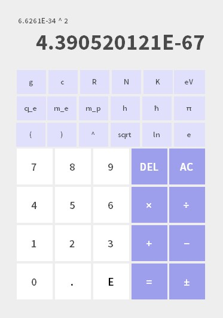

# PHY-Calculator
A calculator for all the PHY294 problem sets I'll never have to do again

It has a bunch of physics constants built in so I don't have to keep Googling them to do problem sets. It's not very good, but at least it looks cute. I'll fix it someday...

